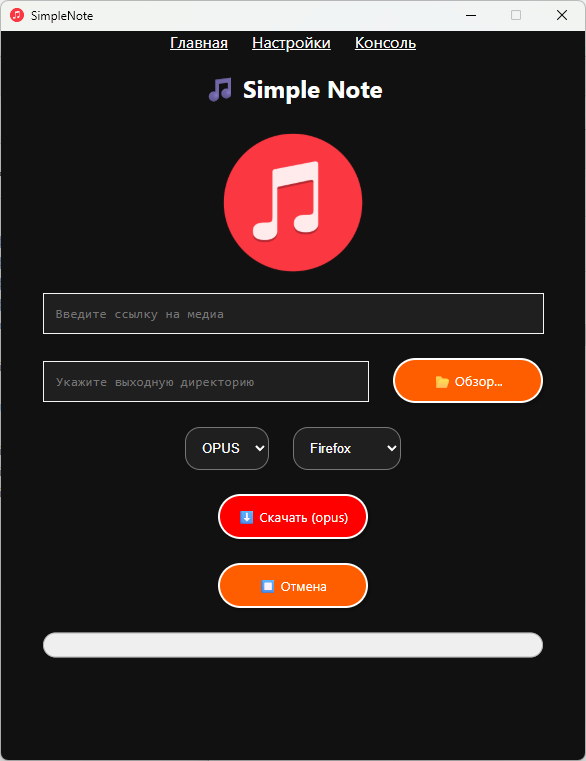

# 🎵 Simple Note: Desktop Media Downloader

<p align="center">

</p>

Легковесное десктопное приложение для загрузки и конвертации аудио из YouTube и других платформ. Разработано с использованием гибридной архитектуры **Go + React (Wails)**.

## Особенности
*   **Нативная производительность:** Бэкенд на Go обеспечивает быструю работу и прямой доступ к файловой системе.
*   **Мощный движок:** Использует `yt-dlp` с интеграцией Node.js runtime для обхода сложных защитных механизмов платформ.
*   **Конвертация на лету:** Автоматическое извлечение аудио и конвертация в MP3, OPUS или AAC через `ffmpeg`.
*   **Интеграция с браузером:** Поддержка извлечения cookies из Firefox, Chrome, Brave и других браузеров для доступа к приватному контенту.
*   **Real-time логи:** Отображение процесса загрузки в интерфейсе приложения без блокировки UI.

## Стек технологий
*   **Backend:** Go (Wails v2)
*   **Frontend:** React (Vite)
*   **Dependencies:** yt-dlp, ffmpeg, Node.js (bundled)

## Быстрый старт (Windows)

Приложение распространяется как portable-решение. Для запуска не требуется установка Python или Node.js в систему.

1.  Скачайте релизную версию или склонируйте репозиторий.
2.  Убедитесь, что в папке `bin` присутствуют файлы:
    *   `yt-dlp.exe`
    *   `ffmpeg.exe`
    *   `node.exe`
3.  Запустите `SimpleNote.exe`.

> ⚠️ **Важно:** Из-за особенностей работы JS-скриптов внутри `yt-dlp` в среде Wails, стабильная работа гарантирована при использовании **Mozilla Firefox** для извлечения cookies. В браузерах на базе Chromium могут возникать ошибки авторизации.

## Сборка проекта (для разработчиков)

Для сборки приложения вам потребуется установленный [Wails CLI](https://wails.io/docs/gettingstarted/installation).

```bash
# Установка зависимостей фронтенда
cd frontend && npm install

# Сборка приложения
wails build
```
## Лицензирование стороннего ПО
Данный проект распространяется под лицензией MIT. Используемые сторонние утилиты имеют свои лицензии:

* **yt-dlp**: Unlicense / MIT License
* **FFmpeg**: LGPL / GPL License
* **Node.js**: MIT License